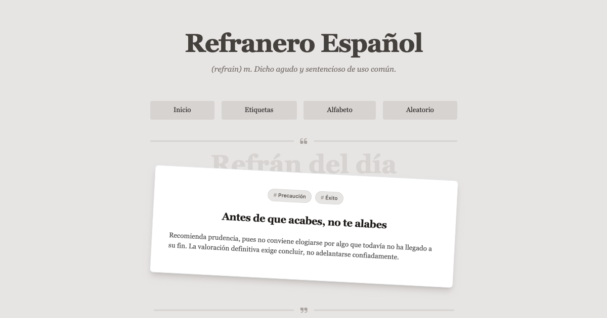

<h1 align="center">Refranero Español</h1>
<h3 align="center">Website de refranes y proverbios españoles.</h3>

<h3 align="center">

[Visitar web](https://refranero-mu.vercel.app/)


</h3>

<p align="center">
    
</p>

---

Los refranes y proverbios se han obtenido mayoritariamente del [Centro Virtual del Instituto Cervantes (cvc.cervantes.es)](https://cvc.cervantes.es/lengua/refranero/) aunque se han añadido algunos más de otras fuentes.


## API

```
https://refranero-mu.vercel.app/api/refranes
https://refranero-mu.vercel.app/api/refranes/{id}
```